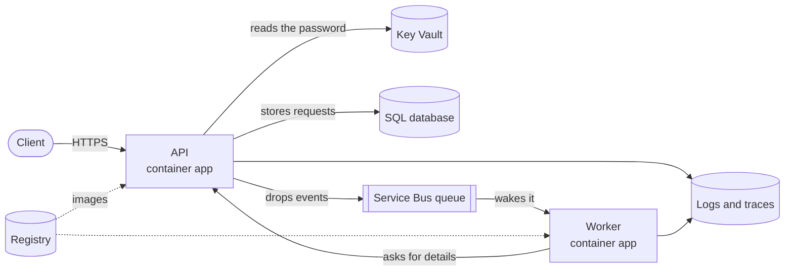

# MaintenanceDesk

MaintenanceDesk is a .NET API for tracking maintenance requests in rental housing. Residents
report issues with their units. Each request is triaged, assigned to a technician, and worked
to resolution against a response deadline.

## Purpose

I built it to learn Azure and cloud infrastructure properly. Its built the way a production service would be, hosted in containers, deployed by a pipeline, holding no
passwords, defined entirely in code, and cheap enough to leave running.

Maintenance requests are the domain because the workflow resembles the case management
  systems I worked with in the real estate industry.

What it sets out to show:

- **No secrets anywhere.** The API reads its database password from Key Vault using a managed
  identity, and GitHub deploys without a stored credential. Nothing to leak, nothing to rotate.
- **Least privilege, verified.** Every permission is granted on a single resource rather than
  the whole group, and each one was checked against the running system.
- **Infrastructure that can be rebuilt.** The environment was destroyed and recreated from
  nothing in **4 min 47 s**, plus **5 min 25 s** to build and deploy — about ten minutes to
  serving traffic.
- **Work that sleeps.** Both applications scale to zero and the database pauses itself. An SLA
  deadline is a message scheduled in the queue, so nothing polls and nothing runs until it is due.

## Architecture



| Part | What it does |
| --- | --- |
| Container Apps | runs both containers, scaling each to zero when idle |
| Container Registry | private store for the two images |
| Azure SQL | serverless database, auto-pauses after an hour |
| Key Vault | holds the database password so nothing else has to |
| Service Bus | carries events from the API to the worker |
| Managed identities | how each app proves who it is, without a password |
| Log Analytics, App Insights | logs, traces and request timings |

The API and the worker are deliberately separate applications. A slow or failing notification
cannot slow down or fail the request that triggered it, and each deploys and scales on its own.

## The code

Three projects, C# on .NET 10.

| Path | Responsibility |
| --- | --- |
| `MaintenanceDesk.Api/Domain` | the vocabulary as code, and the table of legal status transitions |
| `MaintenanceDesk.Api/Data` | EF Core mapping, migrations and seed data |
| `MaintenanceDesk.Api/Services` | the rules: what may change, what the deadline is, what gets saved |
| `MaintenanceDesk.Api/Dtos` | what callers may send and receive, kept separate from the tables |
| `MaintenanceDesk.Api/Controllers` | HTTP in, HTTP out, no logic of their own |
| `MaintenanceDesk.Api/Events` | publishes events to the queue |
| `MaintenanceDesk.Worker` | consumes the queue; no web server, no database of its own |
| `MaintenanceDesk.Tests` | 17 unit tests on the transition rules, 1 integration test over real HTTP and a real database |
| `infra/` | Terraform: every Azure resource |
| `.github/workflows/` | `ci.yml` builds and tests; `deploy.yml` deploys |

| Method and path | Does |
| --- | --- |
| `GET /health` | liveness, including the database |
| `GET /api/maintenance-requests` | paged list |
| `GET /api/maintenance-requests/{id}` | one request |
| `POST /api/maintenance-requests` | report an issue |
| `PATCH /api/maintenance-requests/{id}/status` | move through the workflow |
| `PATCH /api/maintenance-requests/{id}/assignment` | assign a technician |

The status flow is `Submitted → Triaged → Assigned → InProgress → Resolved → Closed`, with
`Cancelled` from anything before `Resolved` and `Resolved → InProgress` to reopen. The legal
moves live in one table rather than scattered `if` statements, so adding a status means adding
a row, and the 17 tests read as a specification of the workflow. Invalid moves return
`409 Conflict` rather than being quietly accepted.

## Running it locally

Needs .NET 10 and Docker. No Azure account required. Without a Service Bus configured, events
go to a no-op publisher and the worker is optional.

```bash
docker run -d --name maintenancedesk-sql -p 127.0.0.1:1433:1433 \
  -e "ACCEPT_EULA=Y" -e "MSSQL_SA_PASSWORD=<a strong password>" \
  mcr.microsoft.com/mssql/server:2022-latest

dotnet user-secrets set "ConnectionStrings:MaintenanceDesk" \
  "Server=127.0.0.1,1433;Initial Catalog=MaintenanceDesk;User Id=sa;Password=<the same>;TrustServerCertificate=True" \
  --project MaintenanceDesk.Api

dotnet tool install --global dotnet-ef
dotnet ef database update --project MaintenanceDesk.Api
dotnet run --project MaintenanceDesk.Api
dotnet test
```

Use `127.0.0.1` rather than `localhost`, which resolves to `::1` first, where the container is
not listening.

## Cost

| Part | Cost |
| --- | --- |
| Container Registry | the only fixed charge, a few dollars a month |
| Container Apps | effectively nothing, both apps sit at zero copies when idle |
| Azure SQL | free tier, paused after an hour idle |
| Service Bus, Key Vault | fractions of a cent at this volume |
| Logging | capped at 1 GB per day |

The caps fail safe: the database is set to pause rather than bill when its monthly allowance
runs out, and log ingestion stops at the daily cap. A runaway loop produces an outage, not an
invoice.

Scaling to zero and auto-pausing are also why the first request after an idle period takes
around a minute, while a warm one takes under half a second. The cost saving and the cold start are the same decision seen from two sides.

## What it does not show

- **No authentication.** Every endpoint is open. Real use needs sign-in, with residents
  restricted to their own requests. The largest gap, and the first thing to add.
- **The worker only logs** what it would send. Wiring in an email or SMS provider is
  configuration and an account, not architecture.
- **One environment.** No staging, adding one means turning the fixed resource names into
  variables, since several must be unique across all of Azure.
- **No custom domain**, so the public address changes whenever the environment is rebuilt.
- **No alerting.** Telemetry is collected and searchable, but nothing pages anyone.
- **No user interface.** It is only an API.
